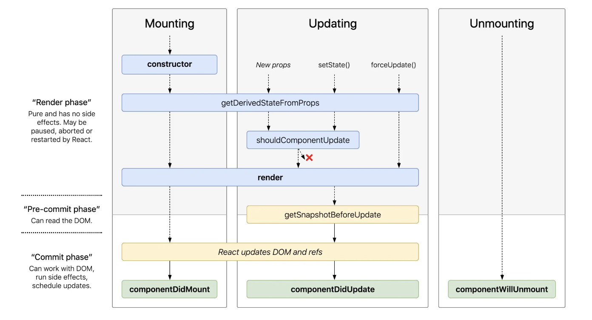

# Lifecycle Events

"Life" moments of a component, from the moment of creation to destruction

3 States



- Mounting
- Updating
- UnMounting

## Mounting

When created, an instance of a component is added to the DOM tree
its called some functions when `Mount` is called

```javascript
(useState(),
  useEffect(() => {
    console.log("MOUNT");
  }, []));
```

When passing an empty dependency in useEffect, it only executes at the initial moment. A use case would be to call the event once, such as feature flags or listening to events.

## Unmounting

- its called when component is removed from Tree

```javascript
import React, { useEffect } from "react";
import { View, Text } from "react-native";

export default function Example() {
  useEffect(() => {
    console.log("Mounted");

    return () => {
      console.log("Unmounted");
    };
  }, []);

  return (
    <View>
      <Text>Hello</Text>
    </View>
  );
}
```

- clear intervals

```
useEffect(() => {
  const interval = setInterval(() => {
    console.log('running...');
  }, 1000);

  return () => clearInterval(interval);
}, []);
```

- Abort controller

```javascript
useEffect(() => {
  const controller = new AbortController();

  fetch("https://api.com/data", { signal: controller.signal })
    .then((res) => res.json())
    .then((data) => setState(data))
    .catch((err) => {
      if (err.name !== "AbortError") {
        console.error(err);
      }
    });

  return () => controller.abort();
}, []);
```
